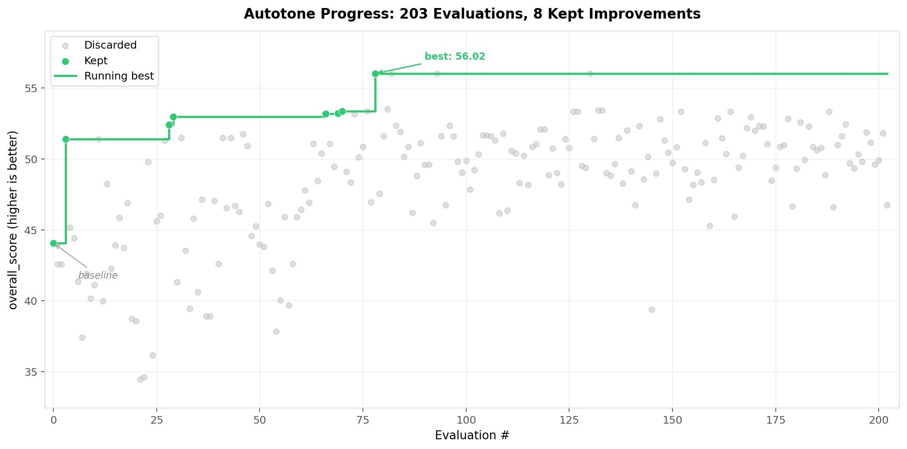

# autotone

[English README](README.md)


<p align="center">
  
</p>
AIエージェントが24時間以上稼働し、200回以上の実験を繰り返して、あなたの文体を再現するプロンプトにチューニングします。[\@karpathy/autoresearch](https://github.com/karpathy/autoresearch) と同じループを、プロンプト最適化に応用したものです。

## 仕組み

このリポジトリは意図的に小さく保ってあり、基本的に重要なのは次のファイルです。

- **`prepare.py`** — 一度だけ行うデータ準備。投稿を train/validation に分け、スタイルプロファイルを作り、トピックを推定します。通常は変更しません。
- **`evaluate.py`** — 固定の evaluator。現在のプロンプトで文章を生成し、LLM judge とローカル特徴量であなたの文体にどれだけ近いかを採点します。通常は変更しません。
- **`prompts/default_prompt.md`** — リポジトリ同梱の初期テンプレート。初回実行時に `working_prompt.md` へ自動コピーされます。その後は変更しません。
- **`prompts/working_prompt.md`** — エージェントが編集する唯一のファイル。LLM に「あなたらしく書く」方法を指示するシステムプロンプト本体です。**エージェントはこのファイルだけを更新します。**（gitignore 対象）
- **`program.md`** — エージェント向けの運用指示。Claude Code にこれを読ませて実行させる想定です。**人間が改善していくファイルです。**

各 experiment は **5 分固定** の予算で動きます。評価指標は **`overall_score`** です。これは LLM judge の評価（文体の近さ、同じ著者らしさ、トピックへの忠実度）に、句読点やリズムなどのローカルな特徴量と、丸写しを防ぐための penalty を組み合わせたものです。

## クイックスタート

**必要環境:** Python 3.10+, [uv](https://docs.astral.sh/uv/), LLM API エンドポイント（OpenAI, Gemini, Anthropic, またはローカル推論用 Ollama）

```bash
# 1. uv をインストール（未導入なら）
curl -LsSf https://astral.sh/uv/install.sh | sh

# 2. 依存を入れる
uv sync

# 3. API 認証情報を設定
cp .env.example .env
# .env を開いて、使う backend に合わせて編集

# 4. 自分の投稿を入れる
#    data/private/raw_posts.jsonl に配置
#    1 行 1 JSON、最低限 "text" があれば動きます
#    {"text":"ここに文章"}

# 5. データを準備（一度だけ）
uv run python prepare.py

# 6. 評価を 1 回実行
uv run python evaluate.py --prompt prompts/working_prompt.md

# 7. （任意）人間向けレポートと raw JSON を出力
uv run python evaluate.py --prompt prompts/working_prompt.md --report
```

ここまで通ればセットアップは完了です。以降は自律的な最適化に進めます。

API を使わない簡易確認モード: `MOCK_LLM=1`

## エージェントの実行

このリポジトリを Claude Code で開き、たとえば次のように指示します。

```
Have a look at program.md and kick off a new experiment. Start with the setup.
```

するとエージェントは 5 分単位で experiment を繰り返し、プロンプトを編集して評価し、改善があれば採用しながら進めます。

想定している共通ワークフローは次のとおりです。

- `program.md` を読む
- `artifacts/latest_agent_input.json` を読む
- `prompts/working_prompt.md` だけを編集する
- `uv run python evaluate.py` を実行する
- `overall_score` を見て採用するか戻すかを判断する

## 構成

```text
prepare.py                   — データ準備とスタイル分析（通常は変更しない）
evaluate.py                  — evaluator と採点処理（通常は変更しない）
generate.py                  — 最適化済みプロンプトから 1 本生成する
prompts/default_prompt.md    — 初期プロンプト
prompts/working_prompt.md    — エージェントが編集するプロンプト（gitignored）
prompts/best_prompt.md       — 現時点の best prompt（自動更新、gitignored）
program.md                   — エージェント向け指示
src/autotone/                — 実装本体（通常は変更しない）
tests/                       — 最小限の回帰テスト
data/private/raw_posts.jsonl — 自分の文章サンプル（gitignored）
```

## 生成されるファイル

evaluator は `artifacts/` 配下にいくつかのファイルを書き出します。それぞれ用途が異なります。

- `latest_eval.json` — **デフォルトで redacted**。スコア、長さ、構造化メトリクスだけを含む安全な要約です。生の reference text、generated text、judge の自由文コメントは含みません。
- `latest_agent_input.json` — エージェント向けの安全な structured input です。次に何を試すか考えるときはこれを読みます。
- `latest_eval_raw.json` — 生の評価出力です。reference text と generated text を含みます。`--report` を付けたときだけ生成されます。
- `latest_report.md` — 人間向けの markdown レポートです。生テキストの例を含みます。`--report` を付けたときだけ生成されます。
- `style_profile.json` / `style_brief.md` / `dataset.json` — `prepare.py` の出力です。

## 設計方針

- **変更対象は 1 ファイルだけ。** エージェントが触るのは `prompts/working_prompt.md` だけです。差分が追いやすく、レビューもしやすくなります。
- **時間予算は固定。** 各 experiment は 5 分です。1 時間で約 12 回、夜通しなら約 100 回試せます。エージェントが何を変えても比較しやすくなります。
- **自己完結。** 外部依存は OpenAI / Anthropic クライアントと dotenv 程度です。fine-tuning も embeddings も vector DB も使いません。1 つの prompt、1 つの evaluator、1 つの metric で完結します。
- **公開前提で安全寄り。** 同梱データは synthetic sample のみです。実データは `data/private/` に置き、`.gitignore` で `.env`、生成 artifact、run log も除外しています。

## モデル backend

`.env` の `LLM_PROVIDER` で backend を選びます。OpenAI、Gemini、Ollama は OpenAI-compatible protocol（`LLM_PROVIDER=openai`）を使います。Anthropic だけは専用 SDK（`LLM_PROVIDER=anthropic`）です。

| Backend | `LLM_PROVIDER` | `OPENAI_BASE_URL` | モデル例 |
|---------|----------------|-------------------|----------|
| OpenAI | `openai` | `https://api.openai.com/v1` | gpt-5-mini, gpt-5 |
| Gemini | `openai` | `https://generativelanguage.googleapis.com/v1beta/openai/` | gemini-2.5-flash, gemini-2.5-pro |
| Ollama | `openai` | `http://localhost:11434/v1` | qwen2.5:14b |
| Anthropic | `anthropic` | *(使わない)* | claude-sonnet-4-20250514 |

Reasoning model（GPT-5, o-series など）にも対応しています。LLM client 側で `max_completion_tokens` や `temperature` まわりの制約を吸収します。

## データの目安

最初は **20〜60 本程度の投稿** が目安です。

- 必須なのは `text` だけです。トピックやメタデータは自動生成されます
- URL ばかりの投稿は外した方がよいです
- repost の定型文は外した方がよいです
- できれば言語は揃っている方が安定します

## Safety

**Sandbox mode:** エージェントを自律実行するときは、書き込み権限を `prompts/working_prompt.md` に限定し、読み取りも `artifacts/` のみに絞るのが安全です。ネットワークと git push はエージェント側で止めてください。

**Artifact privacy:** デフォルトの `artifacts/latest_eval.json` は redacted されており、生の reference/generated text や judge の自由文コメントを含みません。raw text を含む artifact は `--report` 指定時だけ出力され、その場合に `artifacts/latest_eval_raw.json` と `artifacts/latest_report.md` が作られます。

**API privacy:** あなたの文章サンプルと生成結果は、設定した API provider（OpenAI, Gemini, Anthropic, Ollama など）に送られ、生成と評価に使われます。クラウド API を使う場合、データはローカルマシンの外に出ます。できるだけプライベートに保ちたい場合は、Ollama のローカルモデルを使ってください。

**Cost awareness:** 各 experiment では、validation の各サンプルごとに generation と judge を含む複数回の API call が走ります。クラウド API では overnight 実行でコストが積み上がるので、`.env` の `MAX_EVALUATIONS` で評価回数の上限を設定してください。evaluator 側でも hard stop します。互換のため `MAX_EXPERIMENTS` もまだ受け付けます。

**Terminology:** `program.md` 上の 1 つの「5 分 experiment」には、baseline と複数 round の評価が含まれる場合があります。`MAX_EVALUATIONS` が制限するのは 5 分サイクルの数ではなく、evaluator の実行回数です。

**overnight 実行の推奨設定:**

- `MAX_EVALUATIONS` を現実的な値にする（例: 50〜200）
- 料金が読みやすいモデルを使う
- 最初の数サイクルは人間が確認してから放置する

## テスト

`tests/` には小さな回帰テスト群があります。範囲は意図的に絞ってあり、壊れやすい配管部分を主に見ています。

- Anthropic の JSON ハンドリング
- provider 設定ごとの cache key 分離
- topic inference の empty-response fallback
- デフォルト評価 artifact の redaction

実行コマンド:

```bash
PYTHONPATH=src .venv/bin/python -m unittest discover -s tests -v
```

## 謝辞

このプロジェクトは [\@karpathy/autoresearch](https://github.com/karpathy/autoresearch) に強く影響を受けています。元ネタでは AI agent が `train.py` を一晩かけて改善し、[miolini/autoresearch-macos](https://github.com/miolini/autoresearch-macos) はそれを Apple Silicon 向けに調整しています。このリポジトリでは、その shape（single mutable target、fixed evaluator、keep/revert cycle）を保ったまま、モデル学習の代わりに prompt optimization へ置き換えています。

## License

MIT
